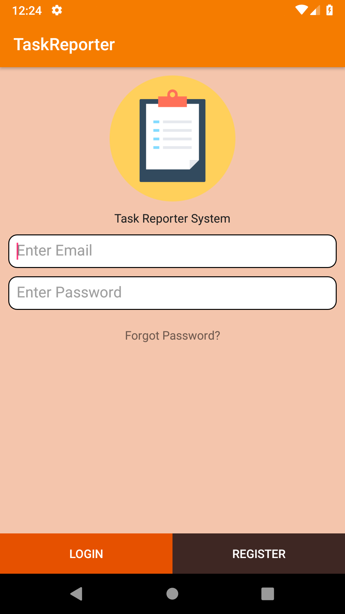
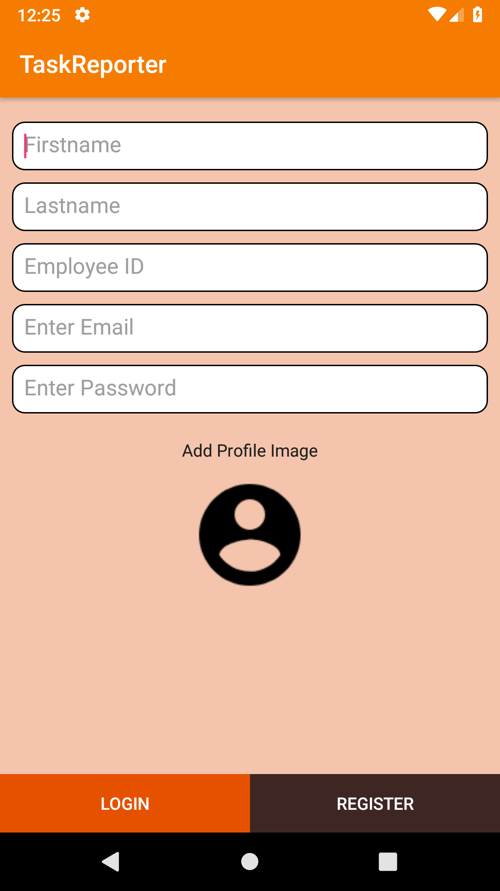
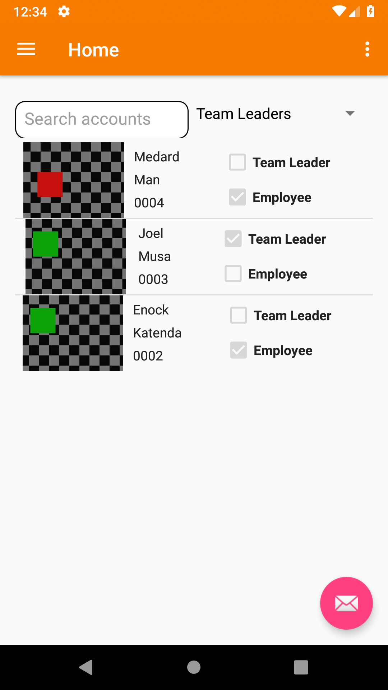
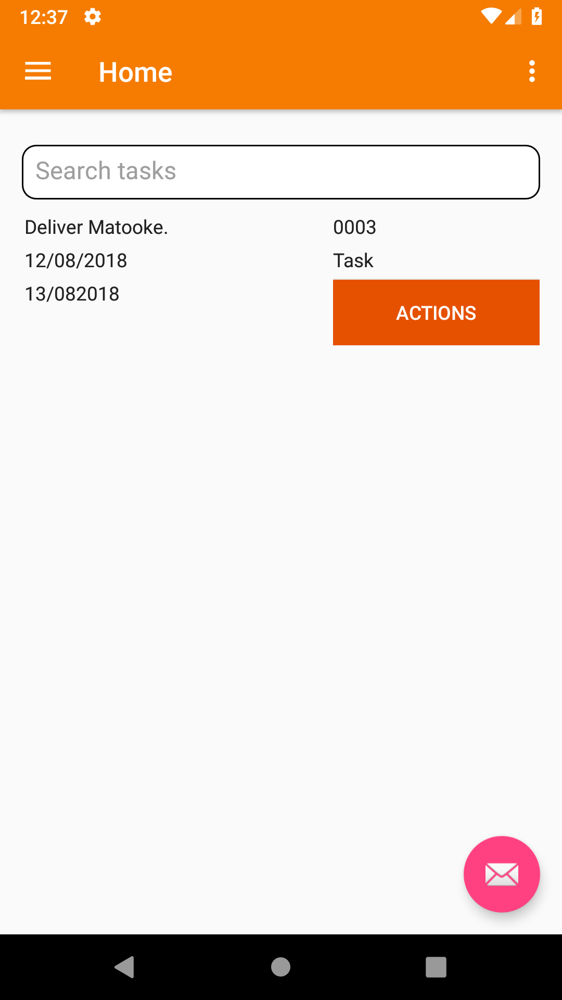
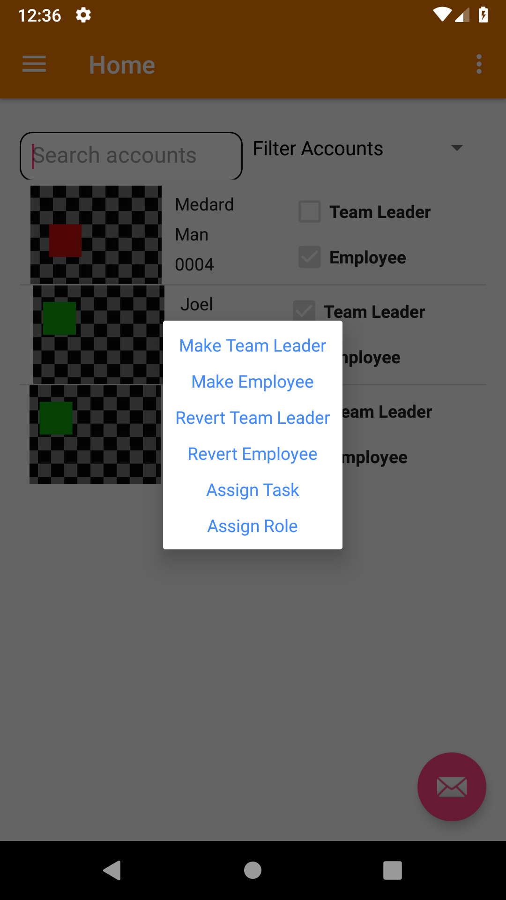

# TaskReporter_android
Manage Employee Tasks beginner android app. This app focuses on beginner functionalities, communication with server...

Place task_reporter folder in php files, in your htdocs in xampp(Windows) or apache server directory in UNIX.

 

 

